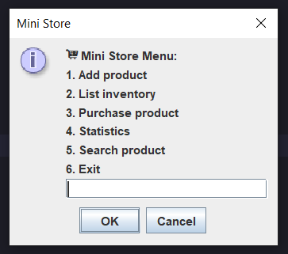

# 🛒 Mini Store JOptionPane

> 📄 This README is also available in [Spanish 🇪🇸](README.es.md)

A simple **inventory management system** built with **Java** using **ArrayList, Array, and HashMap**, integrated with a graphical interface using `JOptionPane`.  
This application allows adding, listing, purchasing, searching products, and displaying statistics with a clear and interactive menu.

---

## ✨ Features

- ➕ Add new products to the inventory (name, price, stock)
- 📋 List all products with price and stock
- 🛒 Purchase products with stock validation and subtotal calculation
- 📊 Show statistics: the cheapest and most expensive product
- 🔎 Search products by partial name matches
- 🧾 Generate a final receipt with total purchases
- ⚠️ Input validations for empty values, number formats, and duplicate products

---

## 🖼️ Preview

Here’s a preview of the application’s main menu:



---

## 📂 Project Structure

```bash
mini-store-joptionpane/
├── src/
│   ├── main/
│   │   ├── java/
│   │   │   └── org.carturo.ministore/
│   │   │       ├── Main.java
│   │   │       ├── model/
│   │   │       │   └── Product.java
│   │   │       ├── service/
│   │   │       │   └── InventoryService.java
│   │   │       └── util/
│   │   │           └── Validation.java
├── .gitignore
├── LICENSE
├── pom.xml
├── README.md
└── README.es.md
```

---

## ⚙️ Requirements

- JDK 21+ (tested with JDK 24)
- Maven 3
- IntelliJ IDEA or any Java IDE
- No additional libraries required

---

## ▶️ Run the Application

1. Compile the project in your IDE.
2. Run `Main.java`.
3. Interact with the `JOptionPane` menu to manage the inventory.

---

## 📜 License

This project is licensed under the [MIT License](LICENSE).
